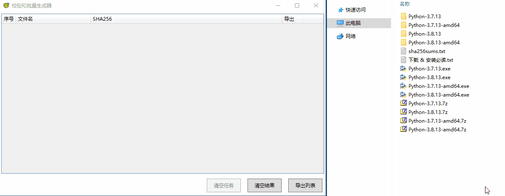

# 文件哈希值批量计算器（HashCalculator）

一款文件哈希值批量计算器，也支持将结果导出为文本文件功能和批量检验哈希值功能。

`程序需要 .Net Framework 4.6.2 或以上版本的支持（Windows 10 1607 及以上版本自带）`

 

# 程序使用方法

1. ## 批量计算文件的哈希值：

    - 在“算法”下拉框选择合适的哈希算法

    - 将文件拖入程序主界面即可生成哈希值，任务未全部完成也可再次拖入其他文件

2. ## 批量检验计算所得哈希值与文件提供者给出的哈希值是否一致

    - 按照第一步`批量计算文件的哈希值`，然后在`哈希值批量检验`处的`依据来源`下拉框选择相应选项：

        - 如果你想填入单个哈希值，则下拉框选择`单个哈希值`

        - 如果你想填入一个包含`哈希值-文件名`的文本文件，则下拉框选择`文本文件`，文件内容的格式需要为每行都是`[哈希值][空格][星号，可无][文件名]`，具体可参考`导出结果`生成的文件内容格式

    - 在下拉框后面的文本框填入哈希值，或者把包含`哈希值-文件名`对的文本文件拖到文本框上（注意：如果填入的内容不是文件路径或者路径不正确，程序会自动把下拉框调整为`单个哈希值`，如果是正确的文件路径则自动调整为`文本文件`）

    - 点击后面的`检验`按钮，程序会将计算结果面板`检验结果`列上色：

        - `白色`表示面板中该行的哈希值还没有被检验过

        - `绿色`表示面板中该行显示的哈希值与`哈希值批量检验`处填入的哈希值一致，或表示该行显示的哈希值与`哈希值批量检验`处填入的文件中对应文件名前的哈希值一致

        - `红色`表示面板中该行所代表的文件显示的哈希值与`哈希值批量检验`处填入的文件中对应文件名前的哈希值不一致

        - `灰色`表示面板中该行的哈希值与`哈希值批量检验`处填入的哈希值不一样，或表示面板中该行显示的文件名在`哈希值批量检验`处填入的文件中找不到

 

# 图示：

 

# 更新日志

[程序更新日志](./CHANGELOG.md)

 
