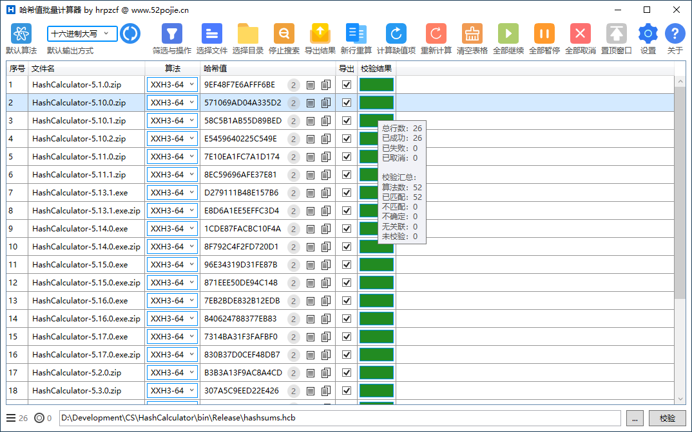
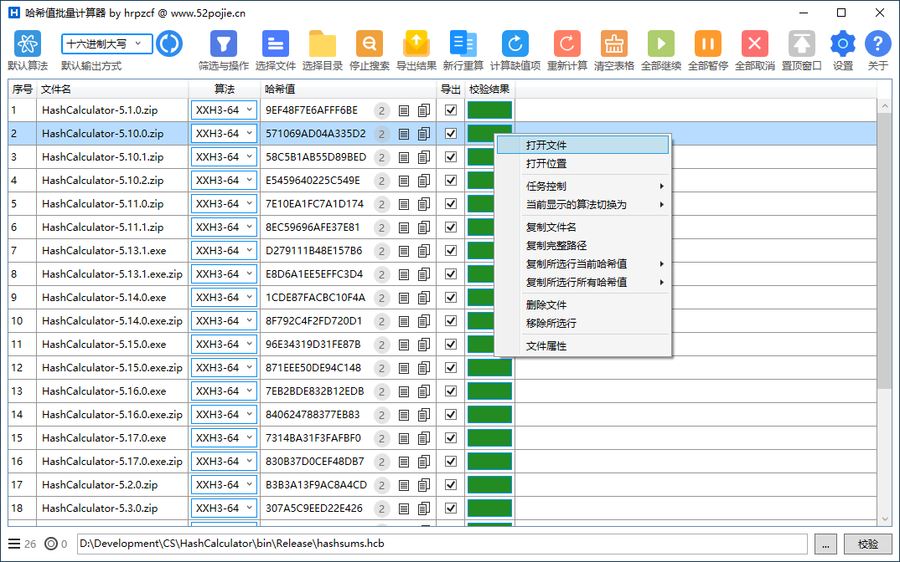
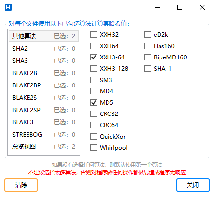
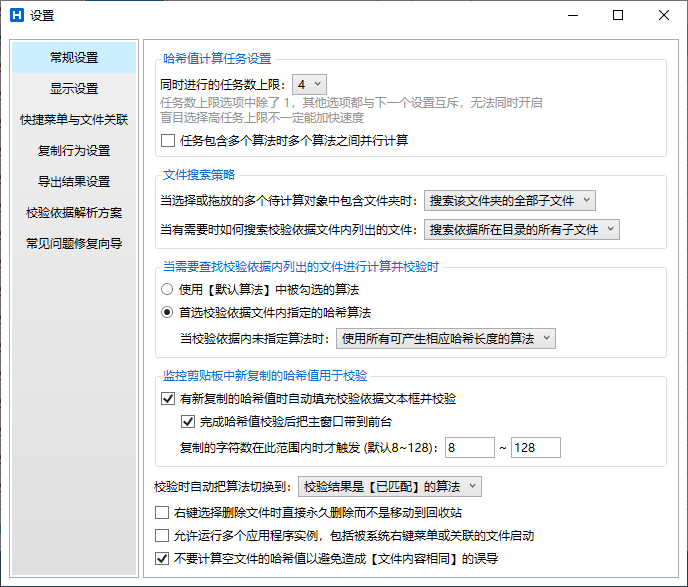
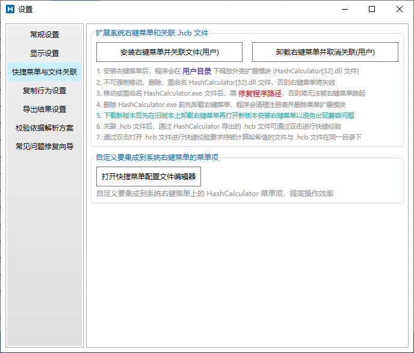
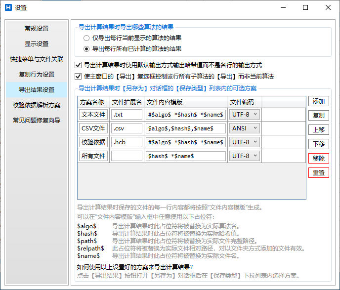
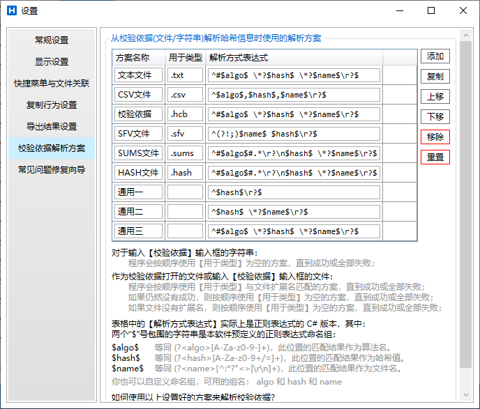
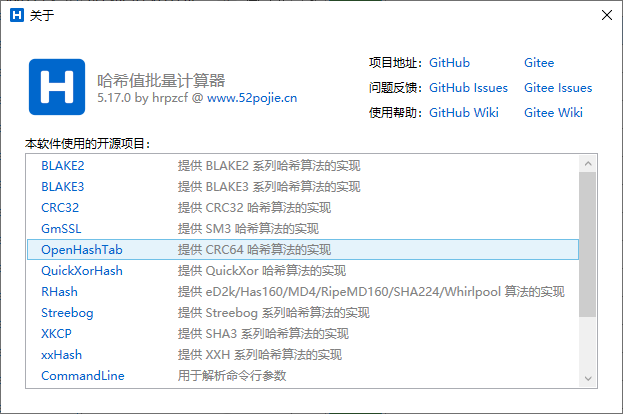

# 哈希值批量计算器 (HashCalculator)

 

# 简介

- HashCalculator 是一个文件哈希值计算工具，为批量计算、批量校验文件的哈希值而生，期望能减少批量计算、校验、统计、查找、筛选方面的麻烦。
- HashCalculator 是一个开源软件，源代码在 [GitHub](https://github.com/hrpzcf/HashCalculator) 和 [Gitee](https://gitee.com/hrpzcf/HashCalculator) 上。 

 

# 功能

- 支持多种哈希算法：
    - SHA1
    - SHA2: 224/256/384/512
    - SHA3: 224/256/384/512
    - XXH32
    - XXH64
    - XXH3-64
    - XXH3-128
    - SM3
    - MD4/MD5
    - CRC32/CRC64
    - QuickXor
    - Whirlpool
    - Streebog: 256/512
    - Blake2b: 224/256/384/512
    - Blake2bp: 224/256/384/512
    - Blake2s: 224/256
    - Blake2sp: 224/256
    - Blake3: 224/256/384/512
    - eD2k
    - Has160
    - RipeMD160
- 单文件运行，无需安装。
- 支持将 HashCalculator 的快捷菜单集成到系统右键菜单，支持自定义快捷菜单。
- 内建多种筛选器，支持对大批量的哈希结果进行筛选、查找、处理。
- 计算所得哈希值的输出方式可选择 Base64 或十六进制大/小写字母。
- 支持同时运行多个计算文件哈希值的任务 (1 ~ 32 个)。
- 每个计算任务可以同时计算一个文件的多个算法的哈希值。
- 支持直接拖拽文件/文件夹到主界面表格中计算文件哈希值。
- 支持在计算过程中暂停、继续、取消所有正在进行的任务或单个正在进行的任务。
- 支持把计算所得的结果导出为文本文件，预置 .txt/.csv/.hcb 导出格式，也可以自定义导出格式。
- 支持自定义校验依据（文件哈希值清单）解析方案，便于直接将同类软件导出的结果作为校验依据打开进行自动校验。
    - 预置 .txt/.csv/.hcb/.sfv/.sums/.hash 等类型文件的解析方案。
- 支持指定命令行参数启动。
- 其他未列出的有用的功能...

 

# 命令行参数说明

1. 子命令：`compute`，用于计算文件或文件夹内的文件的哈希值。
    - 参数 1：`-a`或`--algo`，指定计算文件哈希值的时候使用的算法，可省略。
    - 示例：`hashcalculator compute -a sha_1,sha_256 "文件1路径" "文件2路径" "文件夹1路径" ...`

2. 子命令：`verify`，用于从校验依据文件（文件哈希值清单）获知一批待计算哈希值的文件（文件名或相对路径）并计算，然后与校验依据文件内记录的哈希值进行对比，检查计算结果和校验依据文件内记录的哈希值是否一致。
    - 参数 1：`-a`或`--algo`，指定计算文件哈希值的时候使用的算法，可省略。如果省略该参数则按软件设置的策略决定使用什么算法。
    - 参数 2：`-l`或`--list`，指定校验依据文件（文件哈希值清单）的路径，此参数必需，不可省略。
    - 示例：`hashcalculator verify -a sha_1,sha_256 -l "D:\xxx\sha256sums"`

3. 子命令：`shell`，用于安装或卸载 HashCalculator 的系统右键菜单。
    - 参数 1：`-i`或`--install`，表示安装 HashCalculator 的系统右键菜单，不要与`参数 2`同时使用。
    - 参数 2：`-u`或`--uninstall`，表示卸载 HashCalculator 的系统右键菜单，不要与`参数 1`同时使用。
    - 参数 3：`-s`或`--silent`，可以配合`参数 1`或`参数 2`使用，此参数则表示静默安装/卸载，即使安装/卸载出现异常也不会弹出提示窗口。注：安装/卸载正常的情况下无论是否使用此参数都不会弹出提示窗口。此参数可省略。
    - 示例：`hashcalculator shell --install --silent`

 

# 截图

 

# 使用帮助（未更新）

- [Wiki](https://github.com/hrpzcf/HashCalculator/wiki)
- [Wiki (Gitee)](https://gitee.com/hrpzcf/HashCalculator/wikis/Home)

 

# 更新日志

- [软件更新日志](https://github.com/hrpzcf/HashCalculator/blob/main/CHANGELOG.md)
- [软件更新日志 (Gitee)](https://gitee.com/hrpzcf/HashCalculator/blob/main/CHANGELOG.md)
