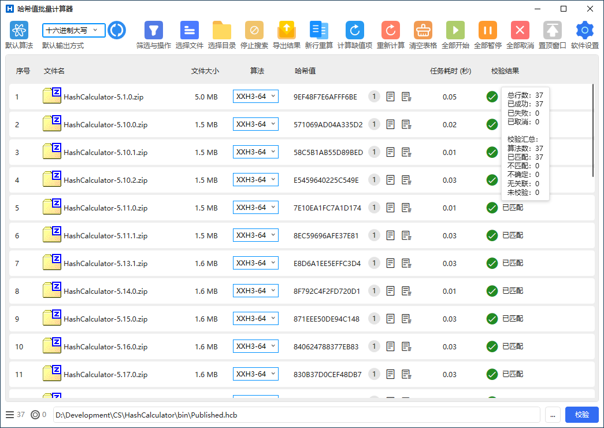
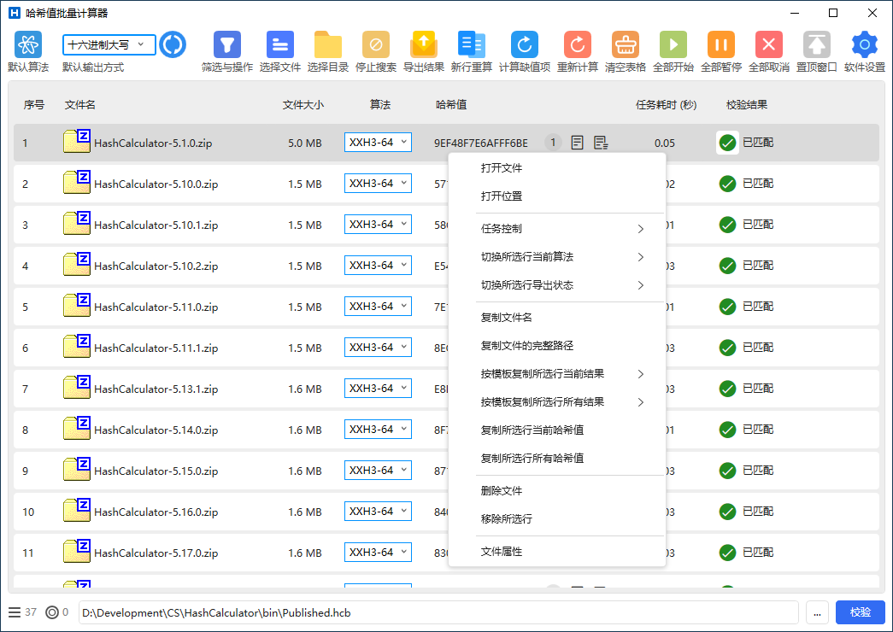
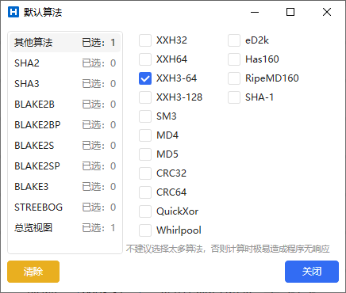
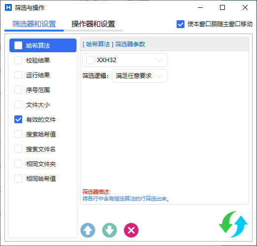
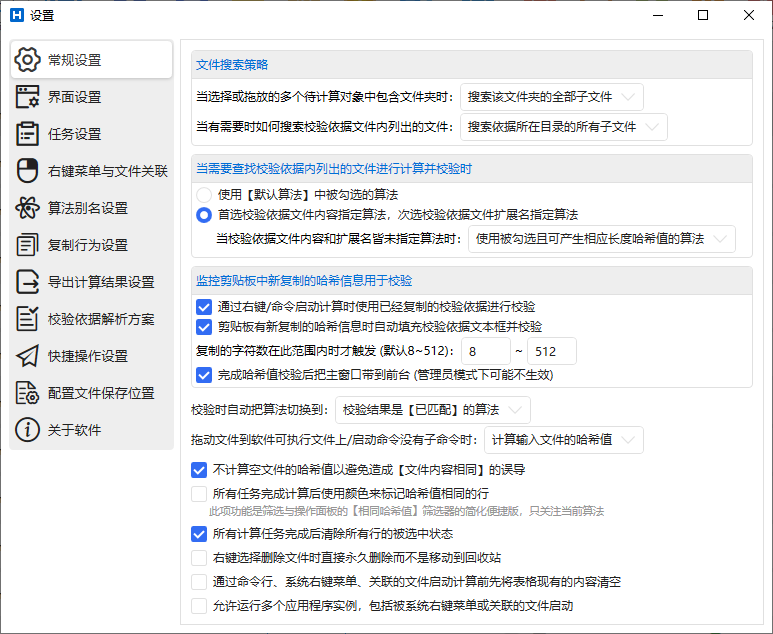
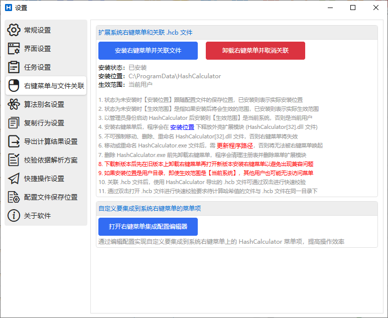
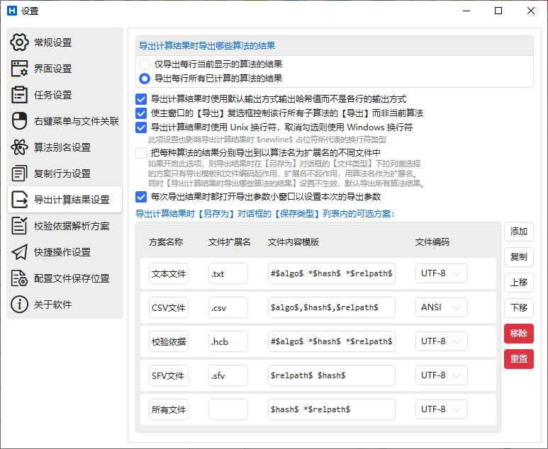
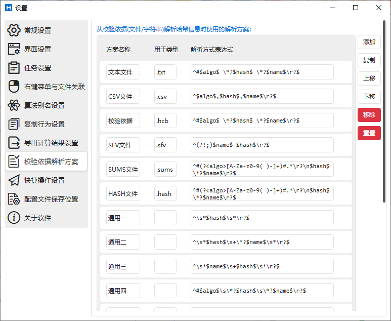
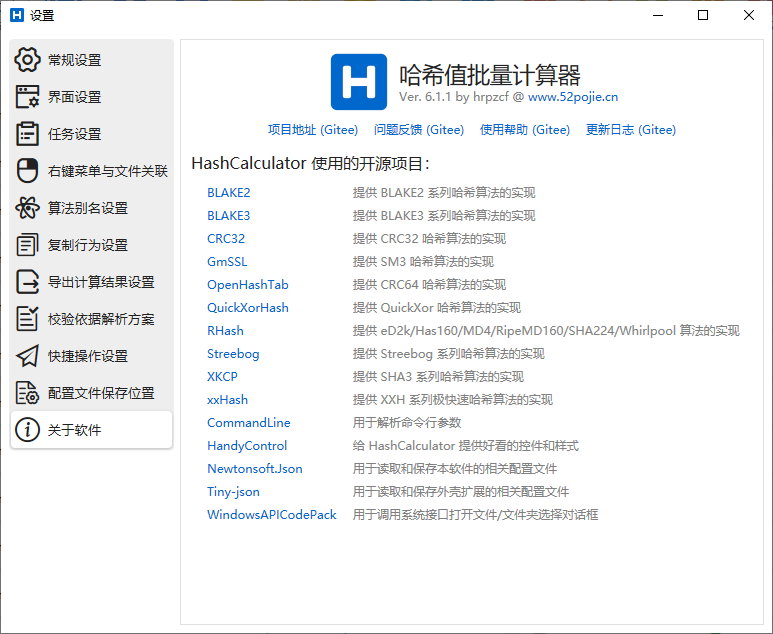

# HashCalculator（哈希值计算器）

 

## 项目介绍

HashCalculator 是一款**开源、免费、单文件免安装**的文件哈希值计算工具，支持**批量计算**与**批量校验**文件哈希值，并提供**统计、查找、筛选**等功能，可有效满足日常文件完整性校验、下载结果核对等场景的需求。

- 技术特点：基于 .NET 10 + WPF 开发，界面现代化，操作流畅。

 

## 下载与使用

- 前往 [Releases](https://github.com/hrpzcf/HashCalculator/releases) 页面下载最新版本的可执行文件。
- 下载后解压（或直接）运行 `HashCalculator.exe` 即可开始使用。
- 也可通过 `hashcalculator` 命令行形式调用（详见下方 [命令行参数说明](#命令行参数说明)）。

 

## 快速开始

1. **计算哈希值**：将文件或文件夹直接拖拽到主界面表格中，或使用「选择文件 / 选择文件夹」按钮添加对象，软件会自动计算所选算法的哈希值。
2. **校验哈希值**：把校验信息（文件哈希值清单）内容粘贴到「哈希值校验信息」输入框，或将 `.hcb` / `.sfv` / `.sums` 等校验信息文件打开，软件即可自动完成比对并显示校验结果。
3. **系统右键菜单**：通过 `shell` 子命令安装右键菜单扩展后，可在资源管理器中右键文件或文件夹一键计算哈希值（详见下方 [命令行参数说明](#命令行参数说明)）。
4. **结果导出**：计算完成后，可一键导出为 `.txt` / `.csv` / `.hcb` 等格式，也支持自定义导出格式。

 

## 功能特性

- 支持多种哈希算法：
    - SHA1
    - SHA2: 224/256/384/512
    - SHA3: 224/256/384/512
    - XXH32
    - XXH64
    - XXH3-64
    - XXH3-128
    - SM3
    - MD4/MD5
    - CRC32/CRC64
    - QuickXor
    - Whirlpool
    - Streebog: 256/512
    - Blake2b: 224/256/384/512
    - Blake2bp: 224/256/384/512
    - Blake2s: 224/256
    - Blake2sp: 224/256
    - Blake3: 224/256/384/512
    - eD2k
    - Has160
    - RipeMD160
- 单文件运行，无需安装。
- 支持将 HashCalculator 的快捷菜单集成到系统右键菜单，支持自定义右键菜单项。
- 内建多种筛选器，支持对大批量的哈希结果进行筛选、查找、处理。
- 计算所得哈希值的输出方式可选择 Base64 或十六进制大/小写字母。
- 支持同时运行多个计算文件哈希值的任务 (1 ~ 32 个)。
- 每个计算任务可以同时计算一个文件的多个算法的哈希值。
- 支持直接拖拽文件/文件夹到主界面表格中计算文件哈希值。
- 支持在计算过程中暂停、继续、取消所有正在进行的任务或单个正在进行的任务。
- 支持把计算所得的结果导出为文本文件，预置 .txt/.csv/.hcb 导出格式，也可以自定义导出格式。
- 支持自定义校验信息（文件哈希值清单）解析方案，便于直接将同类软件导出的结果作为校验信息打开进行自动校验。
    - 预置 .txt/.csv/.hcb/.sfv/.sums/.hash 等类型文件的解析方案。
- 支持指定命令行参数启动。
- 以及更多实用功能。

 

## 命令行参数说明

1. 子命令：`compute`，用于计算文件或文件夹内的文件的哈希值。
    - 参数 1：`-a`或`--algo`，指定计算文件哈希值的时候使用的算法，可省略。
    - 示例：`hashcalculator compute -a sha_1,sha_256 "文件1路径" "文件2路径" "文件夹1路径" ...`

2. 子命令：`verify`，用于从校验信息文件（文件哈希值清单）获知一批待计算哈希值的文件（文件名或相对路径）并计算，然后与校验信息文件内记录的哈希值进行对比，检查计算结果和校验信息文件内记录的哈希值是否一致。
    - 参数 1：`-a`或`--algo`，指定计算文件哈希值的时候使用的算法，可省略。如果省略该参数则按软件设置的策略决定使用什么算法。
    - 参数 2：`-l`或`--list`，指定校验信息文件（文件哈希值清单）的路径，此参数必需，不可省略。
    - 示例：`hashcalculator verify -a sha_1,sha_256 -l "D:\xxx\sha256sums"`

3. 子命令：`shell`，用于安装或卸载 HashCalculator 的系统右键菜单。
    - 参数 1：`-i`或`--install`，表示安装 HashCalculator 的系统右键菜单，不要与`参数 2`同时使用。
    - 参数 2：`-u`或`--uninstall`，表示卸载 HashCalculator 的系统右键菜单，不要与`参数 1`同时使用。
    - 参数 3：`-s`或`--silent`，可以配合`参数 1`或`参数 2`使用，此参数则表示静默安装/卸载，即使安装/卸载出现异常也不会弹出提示窗口。注：安装/卸载正常的情况下无论是否使用此参数都不会弹出提示窗口。此参数可省略。
    - 示例：`hashcalculator shell --install --silent`

 

## 技术栈与运行环境

- **技术框架**：基于 .NET 10 的 WPF 桌面应用
- **主要依赖**：
    - [WPF UI](https://github.com/lepoco/wpfui)（现代化 Fluent experience UI 控件）
- **运行环境**：
    - **系统要求**：推荐 Windows 10 及以上版本。本程序基于 .NET 10 开发，而 .NET 10 不支持 Windows 7，因此程序无法在 Windows 7 上运行。
    - **框架依赖**：本程序依赖 **.NET 10 桌面运行时**（.NET 10 Desktop Runtime），首次使用前请先下载 **.NET 10 桌面运行时** 安装程序进行安装。若未安装，程序将无法运行。
        - 前往 [下载 .NET 10 Desktop Runtime](https://dotnet.microsoft.com/download/dotnet/10.0) 安装程序，根据系统选择 x86 或 x64 版本安装即可。
- **平台版本**：提供 x86 与 x64 两个平台版本。
- **发布形式**：单文件可执行程序，免安装，解压后直接运行。采用框架依赖方式发布，与系统上其他 .NET 程序**共用同一套 .NET 10 桌面运行时**，避免重复打包运行时，节省磁盘空间。

 

## 开源许可

本项目使用 **GNU GPL v3.0** 开源协议授权，详情请参阅 [LICENSE](LICENSE.txt)。

 

## 界面预览

 

## 更新日志

- [程序更新日志](https://github.com/hrpzcf/HashCalculator/blob/main/CHANGELOG.md)
